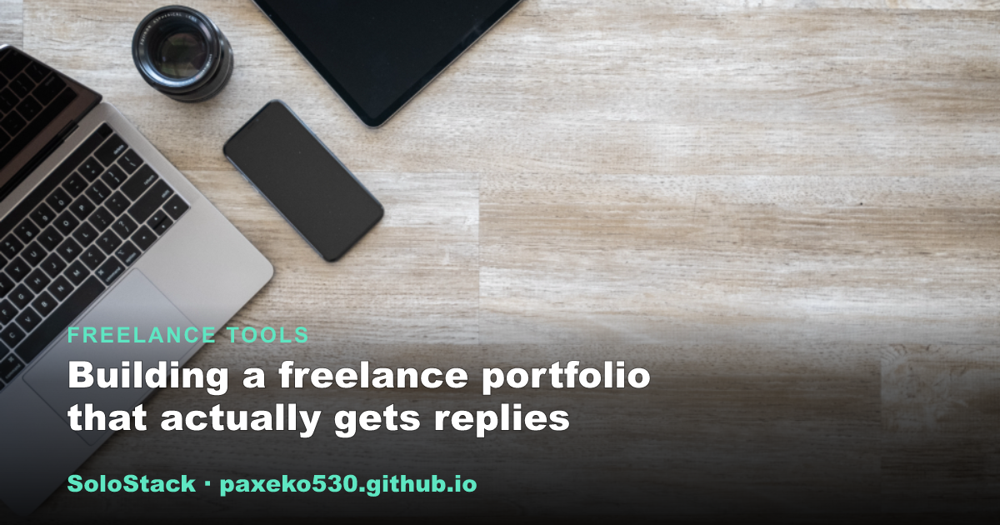
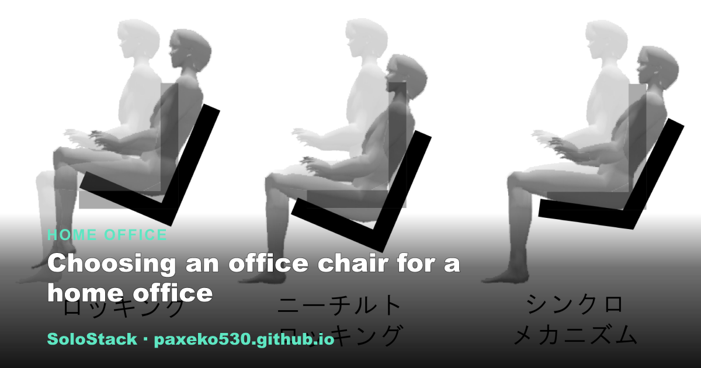
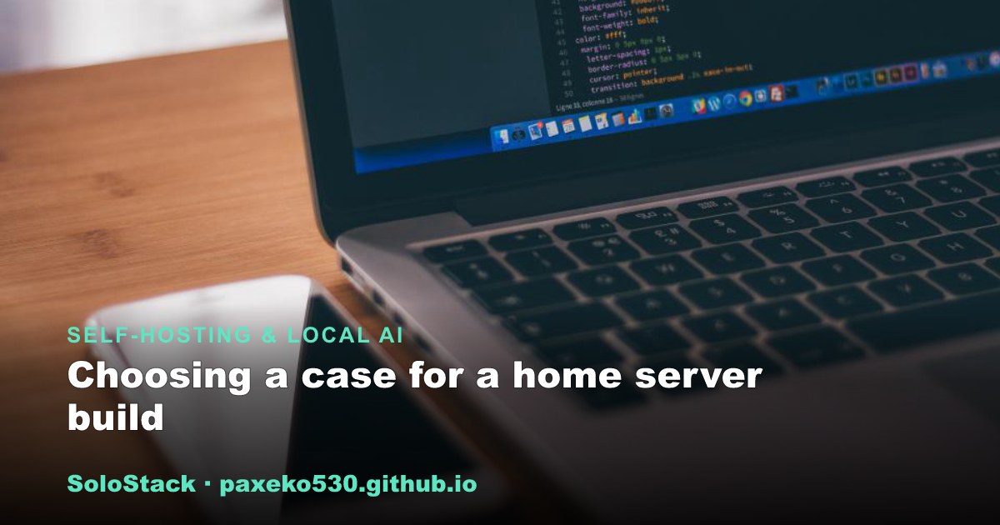

<h1 align="center">SoloStack</h1>

<strong>Practical guides for people who work for themselves.</strong> 
Straight-talking guides on the tools, gear, and setups that make independent work run smoothly.

&nbsp;

---

## Browse by topic

<table><tr>
<td width="33%" valign="top">  <strong><a href="https://paxeko530.github.io/category-freelancer.html">Freelance Tools</a></strong> Software, cash flow, contracts, invoicing</td>
<td width="33%" valign="top">  <strong><a href="https://paxeko530.github.io/category-escritorio.html">Home Office</a></strong> Ergonomics, lighting, remote-work productivity</td>
<td width="33%" valign="top">  <strong><a href="https://paxeko530.github.io/category-ia.html">Self-Hosting &amp; Local AI</a></strong> Home servers, NAS, mini PCs, open-source models</td>
</tr></table>

## Latest guides

- **[Choosing a case for a home server build](https://paxeko530.github.io/posts/choosing-a-case-for-a-home-server-build.html)** &nbsp;Self-Hosting & Local AI
- **[Choosing an office chair for a home office](https://paxeko530.github.io/posts/office-chair-for-a-home-office.html)** &nbsp;Home Office
- **[Self-hosted password manager basics](https://paxeko530.github.io/posts/self-hosted-password-manager-basics.html)** &nbsp;Self-Hosting & Local AI
- **[Noise-cancelling headphones for a shared home office](https://paxeko530.github.io/posts/noise-cancelling-headphones-for-a-shared-home-office.html)** &nbsp;Home Office
- **[Setting up a VPN to access your home server remotely](https://paxeko530.github.io/posts/vpn-for-accessing-your-home-server-remotely.html)** &nbsp;Self-Hosting & Local AI
- **[Choosing a webcam for professional-looking video calls](https://paxeko530.github.io/posts/webcam-for-professional-looking-video-calls.html)** &nbsp;Home Office
- **[Building a freelance portfolio that actually gets replies](https://paxeko530.github.io/posts/building-a-freelance-portfolio-that-gets-replies.html)** &nbsp;Freelance Tools
- **[How much of an emergency fund a freelancer actually needs](https://paxeko530.github.io/posts/freelance-emergency-fund-how-much-to-save.html)** &nbsp;Freelance Tools
- **[Handling scope creep with clients before it eats your margin](https://paxeko530.github.io/posts/handling-scope-creep-with-clients.html)** &nbsp;Freelance Tools
- **[A SATA hard drive docking station for home server projects](https://paxeko530.github.io/posts/sata-hard-drive-docking-station-for-home-server-projects.html)** &nbsp;Self-Hosting & Local AI
- **[Choosing the best desk lamp for eye comfort during long work days](https://paxeko530.github.io/posts/best-desk-lamp-for-eye-comfort.html)** &nbsp;Home Office
- **[Picking a mechanical keyboard for long typing sessions](https://paxeko530.github.io/posts/mechanical-keyboard-for-long-typing-sessions.html)** &nbsp;Home Office

<a href="https://paxeko530.github.io/"><strong>See all &rarr;</strong></a>

## What to expect

- Every guide opens with an on-page outline and closes with an FAQ.
- Some guides recommend gear; the pick is chosen for fit rather than commission, and
  the page says so. Guides without a recommendation stay product-free.

---

<a href="https://paxeko530.github.io/about.html">About</a> &nbsp;&middot;&nbsp;
<a href="https://paxeko530.github.io/how-we-choose.html">How we choose</a> &nbsp;&middot;&nbsp;
<a href="https://paxeko530.github.io/disclosure.html">Affiliate disclosure</a> &nbsp;&middot;&nbsp;
<a href="https://paxeko530.github.io/feed.xml">RSS</a>

