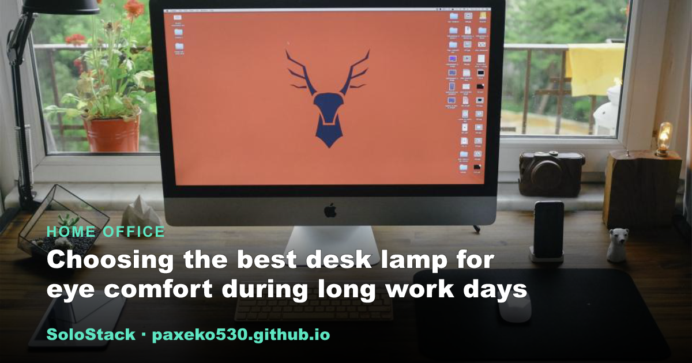
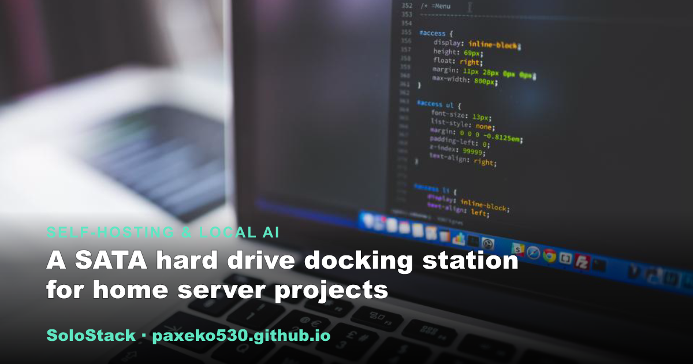

<h1 align="center">SoloStack</h1>

<strong>Practical guides for people who work for themselves.</strong> 
Straight-talking guides on the tools, gear, and setups that make independent work run smoothly.

&nbsp;

---

## Browse by topic

<table><tr>
<td width="33%" valign="top">  <strong><a href="https://paxeko530.github.io/category-freelancer.html">Freelance Tools</a></strong> Software, cash flow, contracts, invoicing</td>
<td width="33%" valign="top">  <strong><a href="https://paxeko530.github.io/category-escritorio.html">Home Office</a></strong> Ergonomics, lighting, remote-work productivity</td>
<td width="33%" valign="top">  <strong><a href="https://paxeko530.github.io/category-ia.html">Self-Hosting &amp; Local AI</a></strong> Home servers, NAS, mini PCs, open-source models</td>
</tr></table>

## Latest guides

- **[A SATA hard drive docking station for home server projects](https://paxeko530.github.io/posts/sata-hard-drive-docking-station-for-home-server-projects.html)** &nbsp;Self-Hosting & Local AI
- **[Choosing the best desk lamp for eye comfort during long work days](https://paxeko530.github.io/posts/best-desk-lamp-for-eye-comfort.html)** &nbsp;Home Office
- **[Picking a mechanical keyboard for long typing sessions](https://paxeko530.github.io/posts/mechanical-keyboard-for-long-typing-sessions.html)** &nbsp;Home Office
- **[Network-attached storage basics for beginners](https://paxeko530.github.io/posts/network-attached-storage-basics-for-beginners.html)** &nbsp;Self-Hosting & Local AI
- **[Quarterly estimated taxes for freelancers: the basics](https://paxeko530.github.io/posts/quarterly-estimated-taxes-for-freelancers-basics.html)** &nbsp;Freelance Tools
- **[When a RAM upgrade helps you run larger local LLMs](https://paxeko530.github.io/posts/ram-upgrade-for-running-larger-local-llms.html)** &nbsp;Self-Hosting & Local AI
- **[Time blocking for freelancers: a system that actually works](https://paxeko530.github.io/posts/time-blocking-for-freelancers-that-actually-works.html)** &nbsp;Freelance Tools
- **[Organizing a small home office on a budget](https://paxeko530.github.io/posts/organizing-a-small-home-office-on-a-budget.html)** &nbsp;Home Office
- **[Prompt basics for getting useful answers from a local LLM](https://paxeko530.github.io/posts/prompt-basics-for-getting-useful-local-llm-answers.html)** &nbsp;Self-Hosting & Local AI
- **[Setting freelance payment terms that actually get honored](https://paxeko530.github.io/posts/setting-freelance-payment-terms-that-stick.html)** &nbsp;Freelance Tools
- **[Setting up automated backups for a mini PC home server](https://paxeko530.github.io/posts/automated-backups-for-a-mini-pc-home-server.html)** &nbsp;Self-Hosting & Local AI
- **[How to chase late invoice payments without losing the client](https://paxeko530.github.io/posts/chasing-late-invoice-payments.html)** &nbsp;Freelance Tools

<a href="https://paxeko530.github.io/"><strong>See all &rarr;</strong></a>

## What to expect

- Every guide opens with an on-page outline and closes with an FAQ.
- Some guides recommend gear; the pick is chosen for fit rather than commission, and
  the page says so. Guides without a recommendation stay product-free.

---

<a href="https://paxeko530.github.io/about.html">About</a> &nbsp;&middot;&nbsp;
<a href="https://paxeko530.github.io/how-we-choose.html">How we choose</a> &nbsp;&middot;&nbsp;
<a href="https://paxeko530.github.io/disclosure.html">Affiliate disclosure</a> &nbsp;&middot;&nbsp;
<a href="https://paxeko530.github.io/feed.xml">RSS</a>

